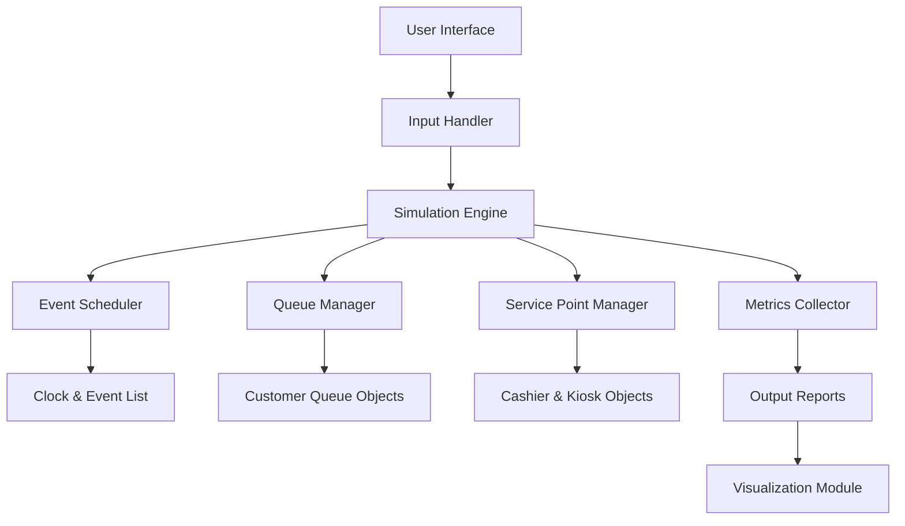

# Human-Machine-Queue-Simulation

```mermaid
flowchart TD
    A[User Interface] --> B[Input Handler]
    B --> C[Simulation Engine]
    C --> D[Event Scheduler]
    C --> E[Queue Manager]
    C --> F[Service Point Manager]
    D --> G[Clock & Event List]
    E --> H[Customer Queue Objects]
    F --> I[Cashier & Kiosk Objects]
    C --> J[Metrics Collector]
    J --> K[Output Reports]
    K --> L[Visualization Module]

```