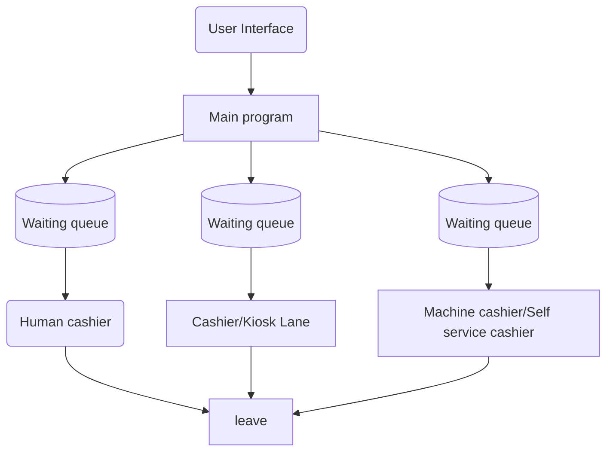

# Human-Machine-Queue-Simulation

```mermaid
flowchart TD
    A(User Interface) -->C[Main program]
    
    C --> D[(Waiting queue)]
    C --> E[(Waiting queue)]
    C --> F[(Waiting queue)]
    
    D --> G(Human cashier)
    E --> H[Cashier/Kiosk Lane]
    F --> I[Machine cashier/Self service cashier]
    
    G --> Q[leave]
    H --> Q
    I --> Q 

```