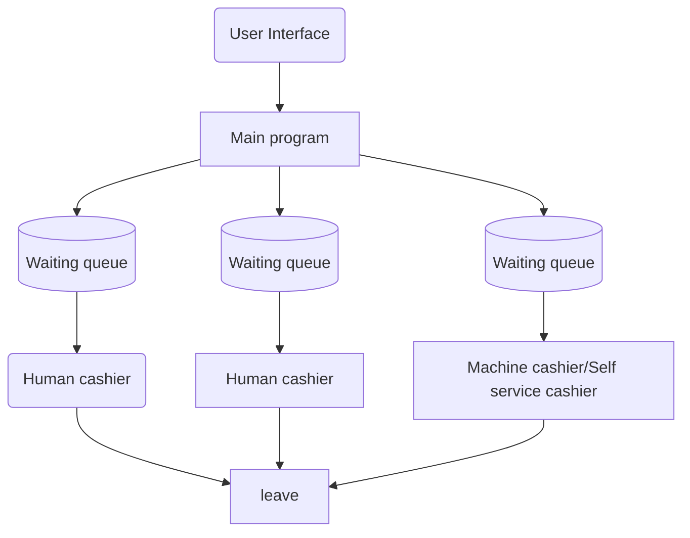

```
+-------------------------------------------------------+
       |                        VIEW                           |
       |  (SimDashboardView.fxml / SimController JavaFX nodes) |
       +-------------------------------------------------------+
           |                                             ^
           | [1] Dispatches User Actions                 | [4] Binds / Listens
           |     (e.g., Sliders, Button Clicks)          |     to Properties
           v                                             |
       +-------------------------------------------------------+
       |                     CONTROLLER                        |
       |                 (SimController.java)                  |
       +-------------------------------------------------------+
           |                                             |
           | [2] Invokes Logic Operations                | [3] Observes Changes
           |     & Schedules Engine Loops                |     via Listeners
           v                                             v
       +-------------------------------------------------------+
       |                        MODEL                          |
       |       (SupermarketModel.java / CheckoutStation)       |
       +-------------------------------------------------------+
```
# Human-Machine-Queue-Simulation

